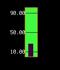

Simple test
------------

Simple demonstration of the gauge library

.. literalinclude:: ../examples/gauge_simpletest.py
    :caption: examples/gauge_simpletest.py
    :linenos:

AS7341 test
------------

Example showing a AS7341 light sensor with up to 8 gages updating the different colors

.. literalinclude:: ../examples/gauge_as7341_text.py
    :caption: examples/gauge_as7341_text.py
    :linenos:
